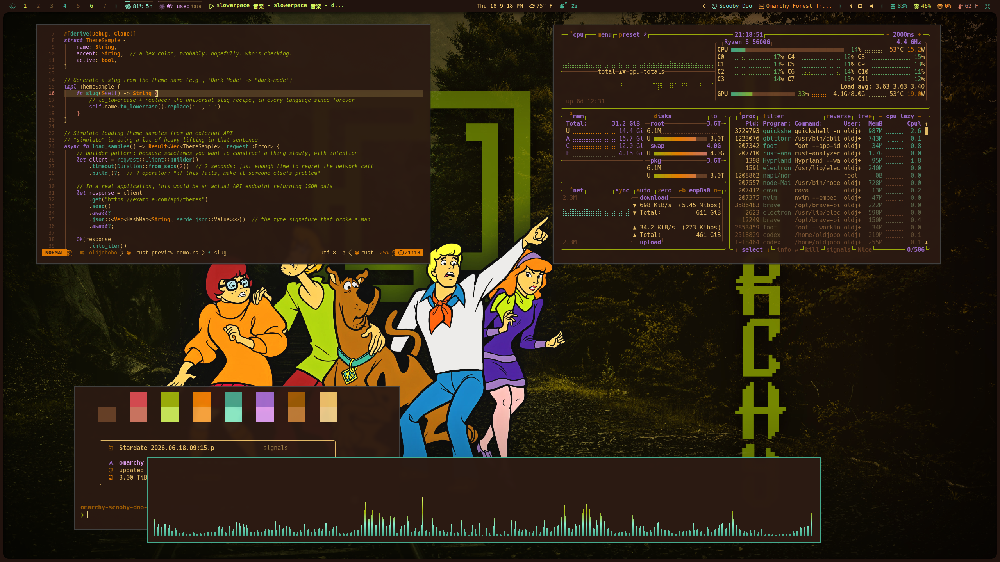
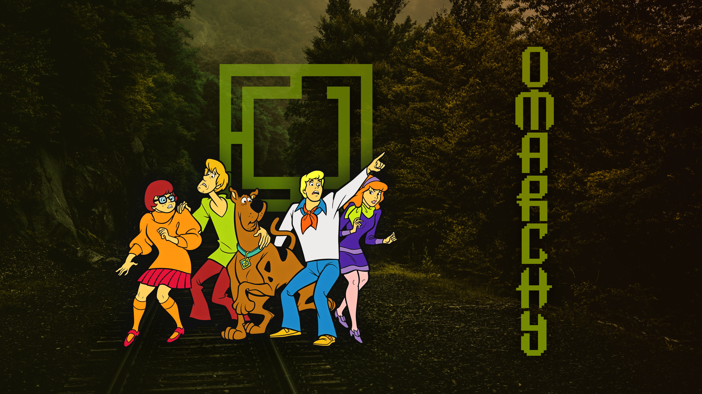
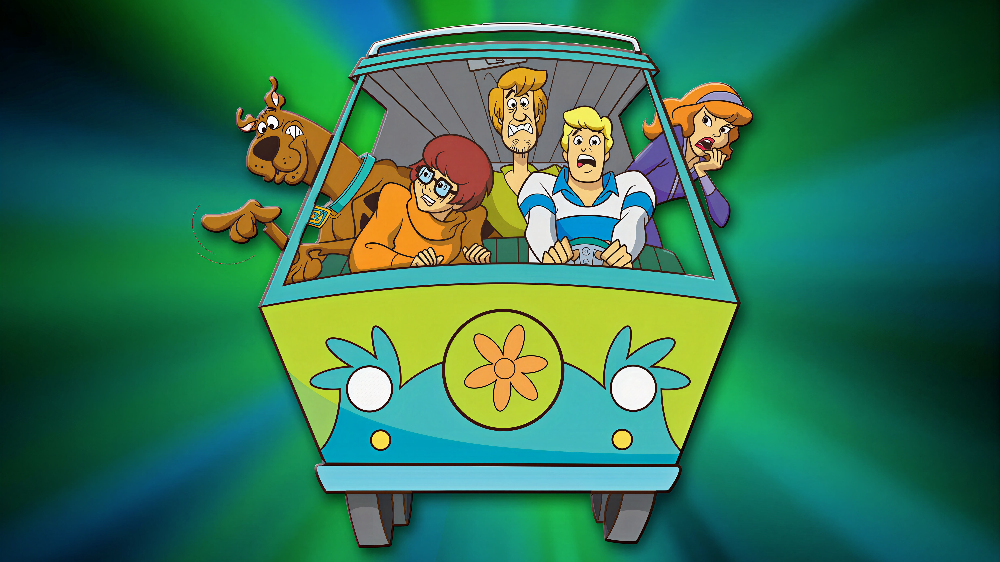
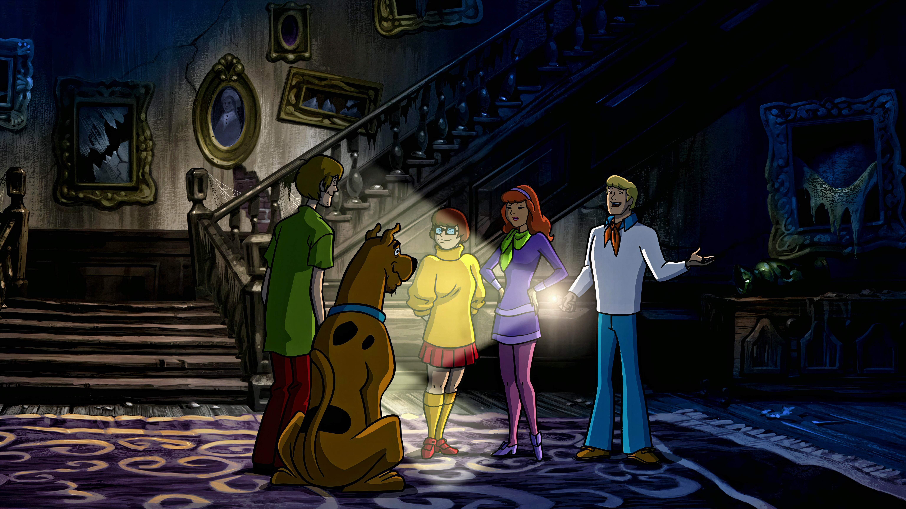
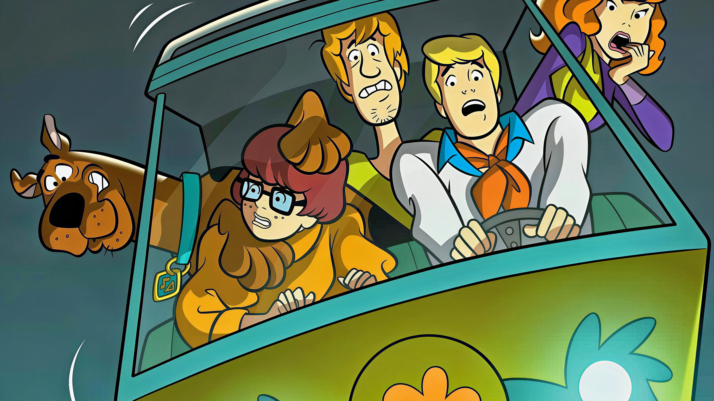

# Omarchy Scooby-Doo Theme

A dark Omarchy theme built around haunted forest shadows, Mystery Machine teal, snack-yellow foregrounds, and bright chase-scene accents. It keeps the desktop warm and readable while leaning into the weird cartoon mystery mood.

## Preview



## Install

Use the Omarchy theme installer:

```bash
omarchy-theme-install https://github.com/OldJobobo/omarchy-scooby-doo-theme
```

## What's Included

- Omarchy `shell.toml` surfaces with warm dark panels, teal focus states, and yellow-orange text accents.
- Hyprland, GTK, Chromium, terminal, and editor color coverage.
- Terminal themes for Foot, Kitty, Alacritty, Ghostty, and Warp.
- App and tool themes for btop, Cava, Neovim, Zellij, Vencord, Zed/Aether, and VS Code.
- A bundled local VS Code theme extension under `vscode-extension/`.
- Four wallpapers plus a 2560x1440 release preview screenshot.

## Wallpapers

<table>
  <tr>
    <td></td>
    <td></td>
  </tr>
  <tr>
    <td></td>
    <td></td>
  </tr>
</table>

## Requirements

- Omarchy with theme installation support.
- `Yaru-prussiangreen-dark` for the matching icon theme named in `icons.theme`.

## Notes

- This repo includes `cava_theme`, a Cava color fragment using the theme's teal, cyan, green, yellow, orange, red, and purple gradient.
- The VS Code theme metadata points at the bundled local extension `local.theme-aether`.

## Attribution

- Licensed under the MIT License. See [LICENSE](LICENSE).
- Scooby-Doo and related characters, names, vehicles, and visual references are intellectual property of Warner Bros. Discovery and its affiliates.
- This is an unofficial fan-made Omarchy theme. It is not affiliated with, endorsed by, sponsored by, or approved by Warner Bros. Discovery.
